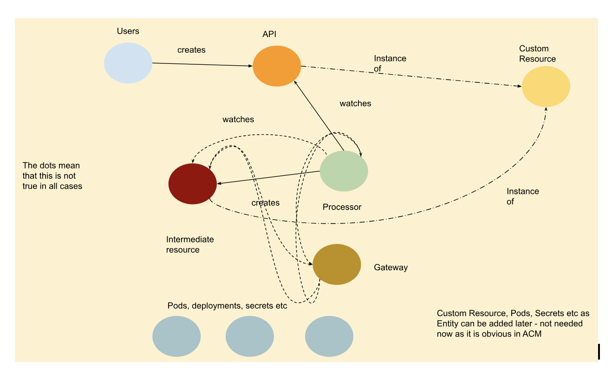

# ACM Knowledge Graph Ontology

## Overview

For details on Knowledge Graphs you can reference other resources.  Perhaps
start with the [README.md](../README.md) in this repository to begin 
learning more.

To get started with Knowledge Graphs in ACM, we want our nodes to consist
of clearly defined entities.  Where possible we want to always re-use the
existing entities that have been defined instead of creating new ones.
Validation is being put in place to help prevent too many entities from
being created, which will make knowledge graph contributions and maintenance
more difficult.

## Entities

The list of entities are validated from the [Glossary](../glossary.txt) file
and consist of the common resources shown below.

See the examples in the [input](../input) folder for examples on how this
ontology is being used.

## Entity Descriptions

Entities are the nodes in the knowledge graph.  The following is a list of the
main entities that are being used in the samples.  While more entities can
be added, they must not duplicate the ones that already exist.

Entity | Description | Samples | Challenges 
---    | ---         | ---     | ---
User | A user of the ACM APIs | Customer, Developer, QE, Support | 
API | The ACM Custom Resource Definitions.  This can also be extended to other APIs such as OpenShift APIs or Non K8S APIs. | ManagedCluster, Policy, Placement | This can seem to overlap with Custom Resource and Intermediate Resource which are also API based. 
Custom Resource | An instance of resource that has been created such as a Policy or Managed Cluster. These resources generally are created through direct User interaction. | Policy, Managed Cluster, Placement, Applications | 
Intermediate Resource | An instance of a resource that was not directly created by a User. | Pods, Deployments, Secrets, ConfigurationPolicy | 
Controller | A running process that manipulates resources | Any pod or operator or even an external rest server/engine. | 
Repository | A storage mechanism for code or other resources. | github.com |

## Attributes of Entities

Each entity (node) will have multiple attributes to help clarify the details
of the node.  This table lists the main attributes.  You should use as many
as possible to help make sure your entities are uniquely defined if they
are unique from other entities that share the same name.

Attribute | Description | Sample | Challenges
---       | ---         | ---    | ---
name | The name that identifies this entity | Pod name, policy name | If the name can be variable use the syntax `{cluster-name}`.
type | The type of resource or controller | Controller, Secret, Job, Policy | The entity, name and type should uniquely identify a resource, and include namespace if it's namespaced.
namespace | The k8s namespace of the resource | default |
onHub | Boolean that is true if this entity exists on the ACM hub | true/false | If the namespace can be variable use the syntax `{cluster-name}`.
onManaged | Boolean that is true if this entity is on managed clusters | true/false |
tag | 

### Notes:

Some notes about the ontology:
- A resource can be treated as Intermediate Resource in one procedure 
(graphml file) because it is created by a Processor, while the same 
resource could be an API node in another procedure (graphml file) 
where the User is able to update it. In this situation, it’s better 
to capture this resource with the same entity, either API or 
Intermediate Resource, in those two procedures to make sure they 
can be treated as a single node in the graph database.
